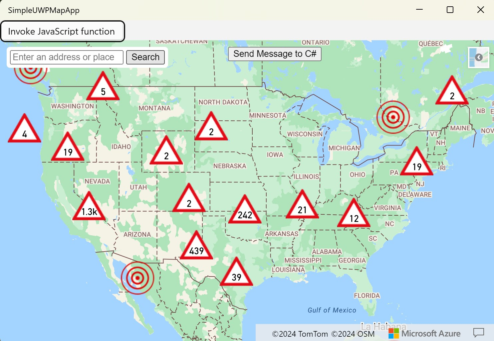

# SimpleUwpAzureMaps

This is a simple code sample for using Azure Maps Web SDK in a UWP app.

This leverages WebView2 which has a lot more capabilties than the default WebView control in UWP (and less bugs). WebView2 is available in the [Microsoft.UI.Xaml library](https://www.nuget.org/packages/Microsoft.UI.Xaml/).

This sample listens for web requests to a specific domain (https://0.0.0.0) and maps them to a folder within the Assets folder of the project. This makes it easy to access these files in a similar way to them being hosted on a server. 

## Running the sample

**Prerequesits:**

- Visual Stuios 2019 or later.
- UWP developer environment installed.
- An Azure Maps subscription key. [Create an Azure Maps key](https://learn.microsoft.com/en-us/azure/azure-maps/quick-demo-map-app#create-an-azure-maps-account)

Once you have the prerequesits, open the project in Visual Studios and add your key to the `MapApp.html` file where it says `<Your Azure Maps Key>`.

## Related Resources

**UWP WebView2**

- https://learn.microsoft.com/en-us/microsoft-edge/webview2/get-started/winui2 
- https://learn.microsoft.com/en-us/microsoft-edge/webview2/concepts/working-with-local-content?tabs=dotnetcsharp
- https://github.com/MicrosoftEdge/WebView2Samples/tree/main/SampleApps/webview2_sample_uwp

**Azure Maps**

- [Documentation](https://learn.microsoft.com/en-us/azure/azure-maps/)
- [Code samples](https://samples.azuremaps.com/)

## License 

MIT

